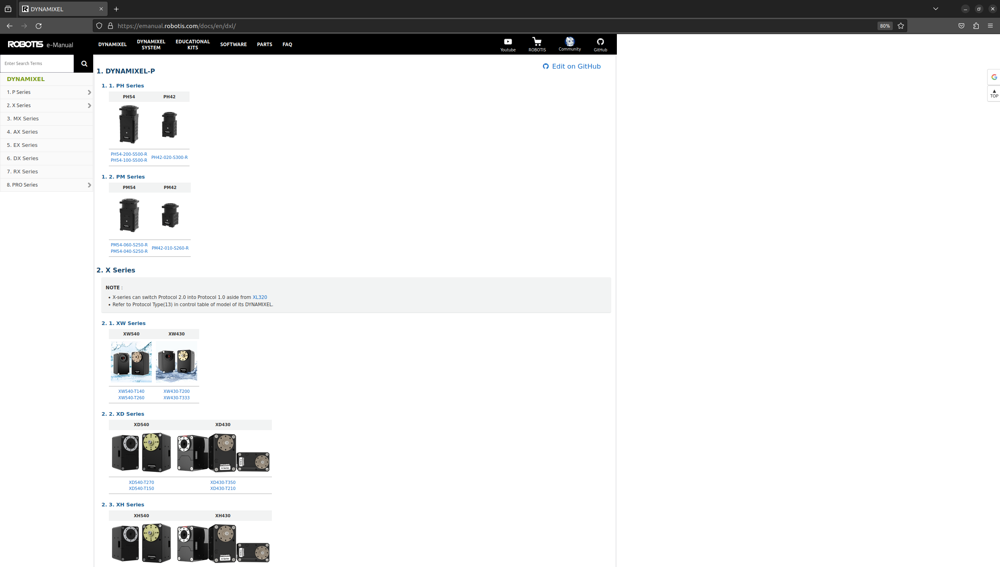
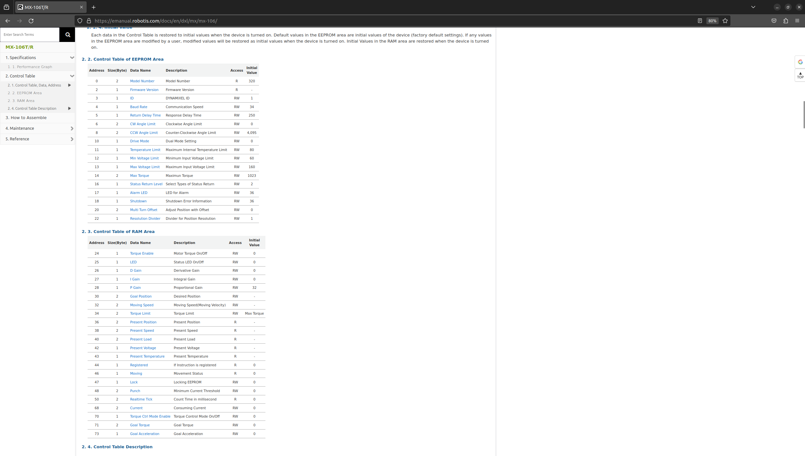
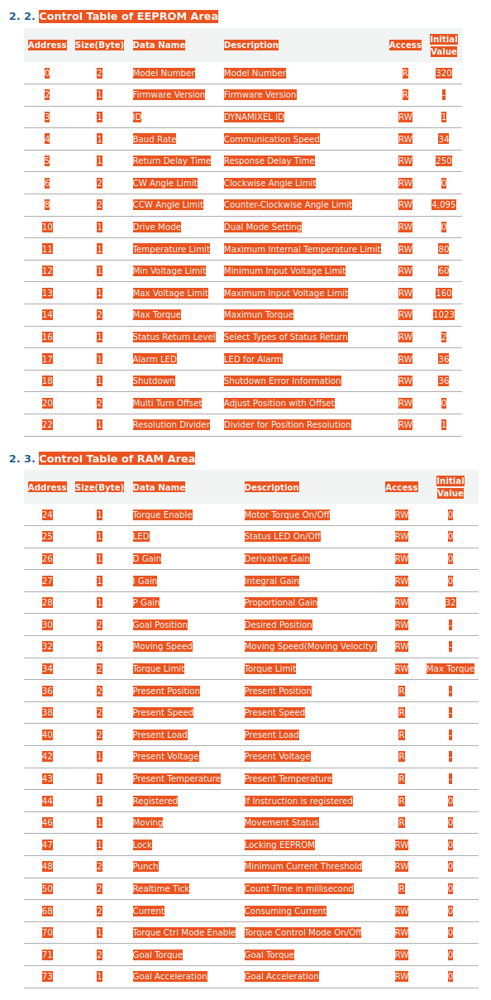

# dynamixel_lib

## Overview

This Python library facilitates the control of Dynamixel motors using the Dynamixel SDK within a Python environment. The library introduces two key classes: `U2D2` and `Dynamixel`. The `U2D2` class manages communication ports, ensuring unique device paths, while the `Dynamixel` class represents individual Dynamixel motors, ensuring unique motor IDs.

## Installation 

### 2. Clone and install this repository
```bash
git clone git@github.com:nate-adkins/dynapy.git
cd dynapy
pip install .
```
### 1. Install the dynamixel SDK 
```bash 
git clone git@github.com:ROBOTIS-GIT/DynamixelSDK.git
cd DynamixelSDK/python
pip install .
```

## Example usage

```python
from dynapy import U2D2, Dynamixel, XL430W250
import time

baudrate = 57600
id = 1

def main():
    u2d2 = U2D2('/dev/ttyUSB0', baudrate)
    motor = Dynamixel(XL430W250, id, u2d2)

    motor.write(XL430W250.OperatingMode, 1)
    motor.write(XL430W250.TorqueEnable, 1)
    motor.write(XL430W250.GoalVelocity, 100)

    try:
        while True:
            time.sleep(1)
    except KeyboardInterrupt:
        motor.write(XL430W250.TorqueEnable, 0)

if __name__ == '__main__':
    main()
```

## How to add support for new motor models:
- This library has been written so that any model of dynamixel will be easily supported.
- Navigate to [dynapy/generate_model_classes/model_ctrl_tables](dynapy/generate_model_classes/model_ctrl_tables)
- There is a .csv file for the MX106 that contains control table values copied from the [robotis emanual for the MX106 model](https://emanual.robotis.com/docs/en/dxl/mx/mx-106/)
- The dynamixel MX106 and XL430 have been implemented first due to their prevelance of use in the lab.
- Below are steps to support additional models of dynamixel motors 

## Steps to copy a new control table:
1.  Go to [robotis emanual for the dynamixels](https://emanual.robotis.com/docs/en/dxl)
2.  Select the new model you want to add to the library
  
3. Navigate to the control table for the new model
  
4. Copy the control table values
  
  **(Be sure to include the EEPROM Area and RAM Area Headers)**
5. Open LibreOffice Calc
6. Select the cell "A1"
7. Paste the values into the sheet and maintain the formatting of the pasted text 
8. Select "File" -> "Save As" 
9. Select "Text CSV (.csv)" as the file type in the bottom right corner
10. Select "dynapy/generate_ctrl_table_vals/model_ctrl_tables" as the save path
11. Change the name of the .csv file to match the name of the motor model. The name of the .csv file will match the name of the python model class that will be generated in step 11.
12. Click "Save"
13. A popup will ask you to confirm the file format. Select "Use Text CSV Format".
14. Another popup will ask you to selext field options. Set the String delimiter to be blank, then select "OK"
12. Now that the .csv file is in the correct format and in the right location, we can generate and add the python class to the existing classes. 
13. Run the [generate_model_classes.py](dynapy/generate_model_classes/generate_model_classes.py) file. This will read through the .csv files (including the one you just added), and generate the model classes. 
14. You can now import and utilize the model class!
15. Back to making cool robots!